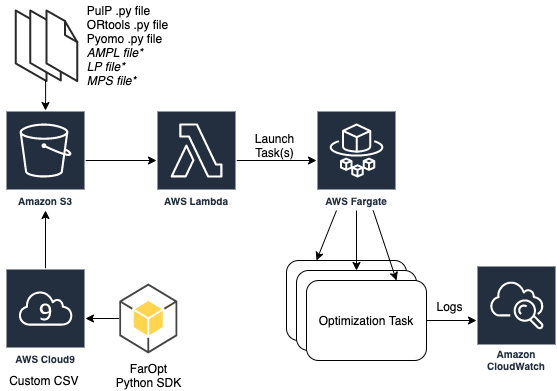
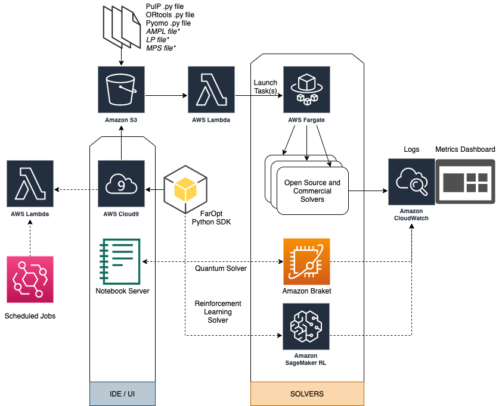

# FarOpt

- Currently supported interfaces - PulP, Pyomo, ORtools, Deap
- Currently supported solvers -  GLPK, COIN-OR CLP/CBC, CP-SAT, GLOP, SCIP *and if you have a license* CPLEX, GUROBI, MOSEK, XPRESS, CHOCO, MIPCL, BARON, SCOOP based EA solvers like ES, GA, CMAES and JuMP. in Julia! 

## Fargate based serverless Numerical Optimization



This architecture is a bare bones template of how you can run optimization models in a serverless fashion on Fargate. The Open source SDK can be used to submit optimization tasks and receive logs. 
Fargate will launch the container, run your code, push logs to cloudwatch and exit - you only pay for the seconds that this _optimzation task_ runs. 

Currently supported frameworks inlcude: 

1. PuLP
1. Pyomo
1. OR Tools
1. JuMP (Julia)


# To create the back end stack:

1. Create a cloud 9 instance (choose the m5.2xlarge instance type, and a suitable availability zone in network settings, like 1a in us-east-1)
2. Clone this repo: `git clone https://github.com/aws-samples/faropt.git`
3. Check if CDK is installed `cdk --version`, or Install CDK: `npm install -g aws-cdk`  
4. cd into the folder (`cd faropt`)
5. Resize the EBS volume `sh resize.sh 50`
6. `sudo pip3 install -r requirements.txt`
7. run `cdk bootstrap --profile default` followed by 
8. `cdk deploy --profile default`

## Using the SDK

```python
from faropt
import FarOpt

fo = FarOpt()

fo.configure('../project/src/')

fo.submit()

fo.logs()
```

## Example code

See example code here - https://github.com/aws-samples/faropt/blob/master/tests/src/main.py

 
<details> 
  <summary>This is an OR Tools example problem on Capacited Vehicle (<i>click to expand</i>)</summary>
    
```python
"""Capacited Vehicles Routing Problem (CVRP)."""

# [START import]
from __future__ import print_function
from ortools.constraint_solver import routing_enums_pb2
from ortools.constraint_solver import pywrapcp
from utils import *
# [END import]


# [START data_model]
def create_data_model():
    """Stores the data for the problem."""
    data = {}
    data['distance_matrix'] = [
        [
            0, 548, 776, 696, 582, 274, 502, 194, 308, 194, 536, 502, 388, 354,
            468, 776, 662
        ],
        [
            548, 0, 684, 308, 194, 502, 730, 354, 696, 742, 1084, 594, 480, 674,
            1016, 868, 1210
        ],
        [
            776, 684, 0, 992, 878, 502, 274, 810, 468, 742, 400, 1278, 1164,
            1130, 788, 1552, 754
        ],
        [
            696, 308, 992, 0, 114, 650, 878, 502, 844, 890, 1232, 514, 628, 822,
            1164, 560, 1358
        ],
        [
            582, 194, 878, 114, 0, 536, 764, 388, 730, 776, 1118, 400, 514, 708,
            1050, 674, 1244
        ],
        [
            274, 502, 502, 650, 536, 0, 228, 308, 194, 240, 582, 776, 662, 628,
            514, 1050, 708
        ],
        [
            502, 730, 274, 878, 764, 228, 0, 536, 194, 468, 354, 1004, 890, 856,
            514, 1278, 480
        ],
        [
            194, 354, 810, 502, 388, 308, 536, 0, 342, 388, 730, 468, 354, 320,
            662, 742, 856
        ],
        [
            308, 696, 468, 844, 730, 194, 194, 342, 0, 274, 388, 810, 696, 662,
            320, 1084, 514
        ],
        [
            194, 742, 742, 890, 776, 240, 468, 388, 274, 0, 342, 536, 422, 388,
            274, 810, 468
        ],
        [
            536, 1084, 400, 1232, 1118, 582, 354, 730, 388, 342, 0, 878, 764,
            730, 388, 1152, 354
        ],
        [
            502, 594, 1278, 514, 400, 776, 1004, 468, 810, 536, 878, 0, 114,
            308, 650, 274, 844
        ],
        [
            388, 480, 1164, 628, 514, 662, 890, 354, 696, 422, 764, 114, 0, 194,
            536, 388, 730
        ],
        [
            354, 674, 1130, 822, 708, 628, 856, 320, 662, 388, 730, 308, 194, 0,
            342, 422, 536
        ],
        [
            468, 1016, 788, 1164, 1050, 514, 514, 662, 320, 274, 388, 650, 536,
            342, 0, 764, 194
        ],
        [
            776, 868, 1552, 560, 674, 1050, 1278, 742, 1084, 810, 1152, 274,
            388, 422, 764, 0, 798
        ],
        [
            662, 1210, 754, 1358, 1244, 708, 480, 856, 514, 468, 354, 844, 730,
            536, 194, 798, 0
        ],
    ]
    # [START demands_capacities]
    data['demands'] = [0, 1, 1, 2, 4, 2, 4, 8, 8, 1, 2, 1, 2, 4, 4, 8, 8]
    data['vehicle_capacities'] = [15, 15, 15, 15]
    # [END demands_capacities]
    data['num_vehicles'] = 4
    data['depot'] = 0
    return data
    # [END data_model]


# [START solution_printer]
def print_solution(data, manager, routing, solution):
    """Prints solution on console."""
    total_distance = 0
    total_load = 0
    for vehicle_id in range(data['num_vehicles']):
        index = routing.Start(vehicle_id)
        plan_output = 'Route for vehicle {}:\n'.format(vehicle_id)
        route_distance = 0
        route_load = 0
        while not routing.IsEnd(index):
            node_index = manager.IndexToNode(index)
            route_load += data['demands'][node_index]
            plan_output += ' {0} Load({1}) -> '.format(node_index, route_load)
            previous_index = index
            index = solution.Value(routing.NextVar(index))
            route_distance += routing.GetArcCostForVehicle(
                previous_index, index, vehicle_id)
        plan_output += ' {0} Load({1})\n'.format(manager.IndexToNode(index),
                                                 route_load)
        plan_output += 'Distance of the route: {}m\n'.format(route_distance)
        plan_output += 'Load of the route: {}\n'.format(route_load)
        print(plan_output)
        total_distance += route_distance
        total_load += route_load
    print('Total distance of all routes: {}m'.format(total_distance))
    log_metric('total_distance',total_distance)
    save('/tmp/task.py') #or some other output
    print('Total load of all routes: {}'.format(total_load))
    # [END solution_printer]


def main():
    """Solve the CVRP problem."""
    # Instantiate the data problem.
    # [START data]
    data = create_data_model()
    # [END data]

    # Create the routing index manager.
    # [START index_manager]
    manager = pywrapcp.RoutingIndexManager(len(data['distance_matrix']),
                                           data['num_vehicles'], data['depot'])
    # [END index_manager]

    # Create Routing Model.
    # [START routing_model]
    routing = pywrapcp.RoutingModel(manager)

    # [END routing_model]

    # Create and register a transit callback.
    # [START transit_callback]
    def distance_callback(from_index, to_index):
        """Returns the distance between the two nodes."""
        # Convert from routing variable Index to distance matrix NodeIndex.
        from_node = manager.IndexToNode(from_index)
        to_node = manager.IndexToNode(to_index)
        return data['distance_matrix'][from_node][to_node]

    transit_callback_index = routing.RegisterTransitCallback(distance_callback)
    # [END transit_callback]

    # Define cost of each arc.
    # [START arc_cost]
    routing.SetArcCostEvaluatorOfAllVehicles(transit_callback_index)

    # [END arc_cost]

    # Add Capacity constraint.
    # [START capacity_constraint]
    def demand_callback(from_index):
        """Returns the demand of the node."""
        # Convert from routing variable Index to demands NodeIndex.
        from_node = manager.IndexToNode(from_index)
        return data['demands'][from_node]

    demand_callback_index = routing.RegisterUnaryTransitCallback(
        demand_callback)
    routing.AddDimensionWithVehicleCapacity(
        demand_callback_index,
        0,  # null capacity slack
        data['vehicle_capacities'],  # vehicle maximum capacities
        True,  # start cumul to zero
        'Capacity')
    # [END capacity_constraint]

    # Setting first solution heuristic.
    # [START parameters]
    search_parameters = pywrapcp.DefaultRoutingSearchParameters()
    search_parameters.first_solution_strategy = (
        routing_enums_pb2.FirstSolutionStrategy.PATH_CHEAPEST_ARC)
    # [END parameters]

    # Solve the problem.
    # [START solve]
    solution = routing.SolveWithParameters(search_parameters)
    # [END solve]

    # Print solution on console.
    # [START print_solution]
    print('printing solutions')
    if solution:
        print_solution(data, manager, routing, solution)
    # [END print_solution]


main()
```

</details>


## Logs from the back end ...

```html
1598041071123 |  Starting FarOpt backend
1598041071123 | ███████╗ █████╗ ██████╗  ██████╗ ██████╗ ████████╗
1598041071123 | ██╔════╝██╔══██╗██╔══██╗██╔═══██╗██╔══██╗╚══██╔══╝
1598041071123 | █████╗  ███████║██████╔╝██║   ██║██████╔╝   ██║   
1598041071123 | ██╔══╝  ██╔══██║██╔══██╗██║   ██║██╔═══╝    ██║   
1598041071123 | ██║     ██║  ██║██║  ██║╚██████╔╝██║        ██║   
1598041071123 | ╚═╝     ╚═╝  ╚═╝╚═╝  ╚═╝ ╚═════╝ ╚═╝        ╚═╝  
.
.
.
.
.
```

## What's coming up?
1. Scheduling optimization jobs
1. Demand forecasting using Forecast
1. Quantum Approximate Optimization Algorithm
1. SageMaker RL solvers for certain problem types



# How to use this CDK project (Backend setup)

First set up CDK (see prerequisites section here - https://docs.aws.amazon.com/cdk/latest/guide/getting_started.html)

You should explore the contents of this project. It demonstrates a CDK app with an instance of a stack (`faropt_stack`)
which contains an Amazon SQS queue that is subscribed to an Amazon SNS topic.

The `cdk.json` file tells the CDK Toolkit how to execute your app.

This project is set up like a standard Python project.  The initialization process also creates
a virtualenv within this project, stored under the .env directory.  To create the virtualenv
it assumes that there is a `python3` executable in your path with access to the `venv` package.
If for any reason the automatic creation of the virtualenv fails, you can create the virtualenv
manually once the init process completes.

To manually create a virtualenv on MacOS and Linux:

```
$ python3 -m venv .env
```

After the init process completes and the virtualenv is created, you can use the following
step to activate your virtualenv.

```
$ source .env/bin/activate
```

If you are a Windows platform, you would activate the virtualenv like this:

```
% .env\Scripts\activate.bat
```

Once the virtualenv is activated, you can install the required dependencies.

```
$ pip install -r requirements.txt
```

At this point you can now synthesize the CloudFormation template for this code.

```
$ cdk synth
```

You can now begin exploring the source code, contained in the hello directory.
There is also a very trivial test included that can be run like this:

```
$ pytest
```

To add additional dependencies, for example other CDK libraries, just add to
your requirements.txt file and rerun the `pip install -r requirements.txt`
command.

## Useful commands

 * `cdk ls`          list all stacks in the app
 * `cdk synth`       emits the synthesized CloudFormation template
 * `cdk deploy`      deploy this stack to your default AWS account/region
 * `cdk diff`        compare deployed stack with current state
 * `cdk docs`        open CDK documentation

Enjoy!
